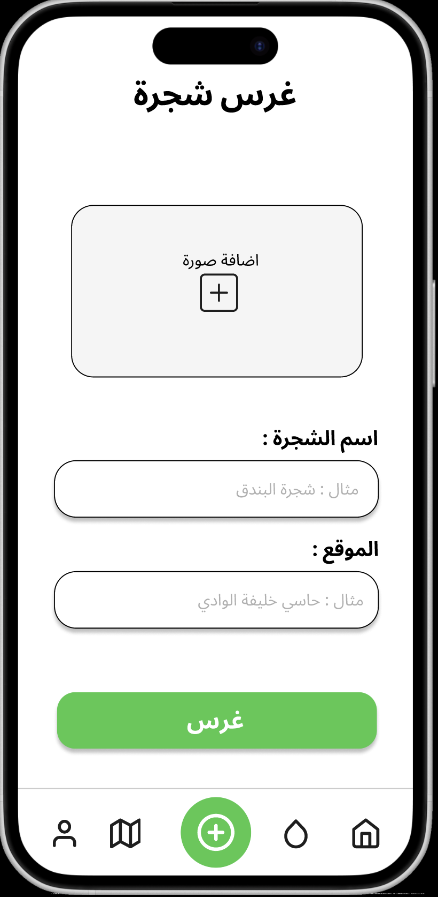

# Task 3: Understanding Dependency Injection and Implementing Add Tree Feature

## Dependency Injection with Dagger Hilt

The Khadra app now uses Dagger Hilt for dependency injection across all layers of the application. Here's how it's structured:

### 1. Data Layer
- Repository implementations are provided via Hilt modules
- Data sources and their dependencies are injected into repositories
- Example: `TreeRepository` and `TreeTypeRepository` are injected with their dependencies

### 2. Domain Layer
- Use cases are injected with their required repositories
- Examples:
  - `GetTreesUseCase` is injected with `TreeRepository`
  - `AddTreeUseCase` is injected with `TreeRepository`
  - `GetTreeTypesUseCase` is injected with `TreeTypeRepository`

### 3. Presentation Layer
- ViewModels are annotated with `@HiltViewModel`
- Use cases are injected into ViewModels
- Example: `TreeViewModel` is injected with `GetTreesUseCase`

## Your Task: Implement Add Tree Feature

### 1. Create Add Tree View
Create a new composable function `AddTreeScreen` in the presentation layer with the following requirements:

- Input fields for:
  - Tree name (Arabic)
  - Tree type (dropdown selection)
  - Status selection (Healthy, Moderate, Low, Critical)
  - Location coordinates
  - Image URL
- Validation for all fields
- Submit button
- Success/Error feedback

### 2. Enhance AddTreeViewModel

Update the `AddTreeViewModel` to include:

```kotlin
// State for form fields
data class AddTreeState(
    val name: String = "",
    val type: String = "",
    val status: String = "",
    val coordinates: Pair<Double, Double> = Pair(0.0, 0.0),
    val imageUrl: String = "",
    val isLoading: Boolean = false,
    val error: String? = null,
    val isSuccess: Boolean = false
)

// Events that can be triggered
sealed class AddTreeEvent {
    data class NameChanged(val name: String) : AddTreeEvent()
    data class TypeSelected(val type: String) : AddTreeEvent()
    data class StatusSelected(val status: String) : AddTreeEvent()
    data class CoordinatesChanged(val latitude: Double, val longitude: Double) : AddTreeEvent()
    data class ImageUrlChanged(val url: String) : AddTreeEvent()
    object Submit : AddTreeEvent()
}
```

Required functionality:
1. State management for form fields
2. Input validation
3. Error handling
4. Integration with `AddTreeUseCase`
5. Success/failure feedback

### Implementation Steps

1. **AddTreeViewModel Implementation**
   - Add state management using `StateFlow`
   - Implement event handling
   - Add validation logic
   - Integrate with `AddTreeUseCase`

2. **AddTreeScreen Implementation**
   - Create UI components using Jetpack Compose
   - Connect UI events to ViewModel
   - Show loading state
   - Display error messages
   - Show success confirmation

3. **Navigation Integration**
   - Add navigation to Add Tree screen (already integrated in bottom navigation)
   - Handle back navigation
   - Pass results back to previous screen

### Success Criteria

Your implementation should:
1. Successfully add new trees to the repository
2. Validate all input fields
3. Show appropriate loading states
4. Handle and display errors
5. Provide success feedback
6. Follow MVVM architecture patterns
7. Properly utilize dependency injection

## Tips
- Use `viewModelScope` for coroutines in ViewModel
- Implement proper error handling
- Follow Material Design guidelines for the UI
- Use proper state management
- Make use of Hilt's dependency injection
- Consider using location services for coordinates
- Ensure proper Arabic text handling

## Bonus Challenges
1. Add image upload functionality instead of URL
2. Implement form state persistence
3. Add unit tests for ViewModel
4. Add UI tests for the Add Tree screen
5. Add map integration for selecting coordinates
6. Implement real-time validation

## Add Tree UI Design

The Add Tree screen should follow the app's existing design language:
- Use the KhadraGreen color theme
- Maintain right-to-left (RTL) layout for Arabic text
- Follow the existing card and input field styles
- Use consistent typography and spacing



Good luck with implementing the Add Tree feature!
